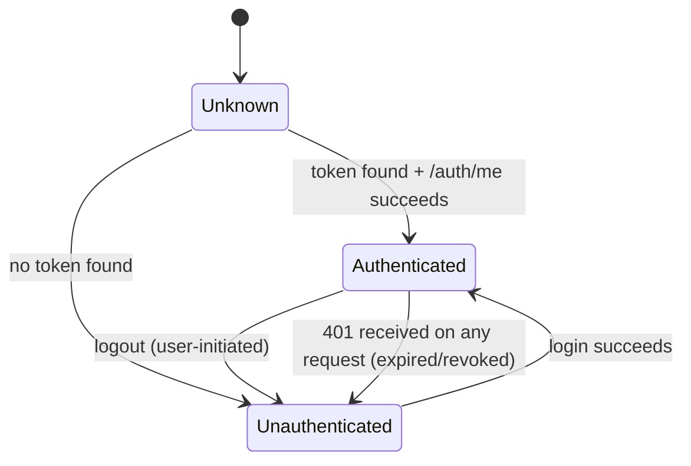
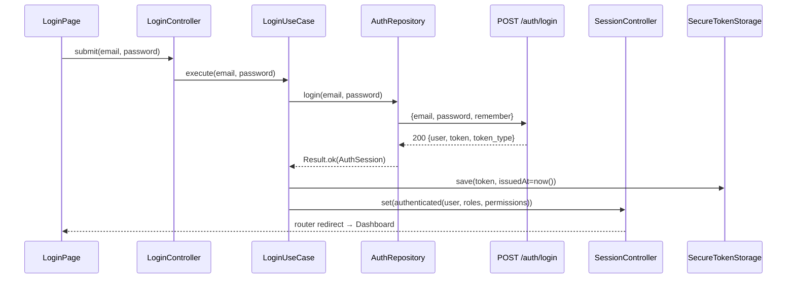

# 06 — Authentication Flow (Flutter Mobile App)

Detailed authentication design, building on [04-MOBILE-ARCHITECTURE.md §5](04-MOBILE-ARCHITECTURE.md) and the backend facts in [01-EXISTING-SYSTEM.md §2](01-EXISTING-SYSTEM.md).

> **Status implementasi (2026-08-02).** Bagian berikut **sudah diimplementasikan**,
> dengan struktur lebih sederhana dari rancangan awal dokumen ini (tidak ada
> lapisan `SessionController`/use-case terpisah — `AuthController` +
> `AuthRepository` yang memegang perannya):
>
> - **§3 offline-tolerant session restore** → `AuthController._bootstrap()`
>   ([mobile/lib/features/auth/presentation/auth_controller.dart](../mobile/lib/features/auth/presentation/auth_controller.dart)).
>   Profil di-cache lewat `UserCacheStore` (SharedPreferences), bukan hanya token.
>   Penanda sesi belum terverifikasi = `AuthState.isSessionVerified`, bukan varian
>   sealed-state tersendiri.
> - **Indikator koneksi** → `BackendStatusDot` + `backendStatusProvider`
>   ([mobile/lib/core/network/backend_status.dart](../mobile/lib/core/network/backend_status.dart)),
>   disimpulkan dari hasil request Dio terakhir (tanpa polling).
> - **Login via kode akses sekali-pakai** → §4a di bawah.
>
> - **§6 interceptor 401 global** → interceptor Dio di
>   [mobile/lib/core/providers.dart](../mobile/lib/core/providers.dart) memicu
>   `unauthorizedSignalProvider`, yang didengarkan `AuthController` untuk
>   `forceLogout()`. Sinyal netral ini dipakai (bukan Dio memanggil
>   `authControllerProvider` langsung) agar `core/` tak bergantung ke `features/`
>   dan tak terbentuk siklus provider. Endpoint login dikecualikan — 401 di sana
>   berarti kredensial salah, bukan sesi kedaluwarsa.
>
> Yang **belum**: rekomendasi §8.1/§8.2 (masih gap backend), dan snackbar
> "sesi berakhir" satu kali (§6 poin 5) — saat ini user langsung diarahkan ke
> layar login tanpa pesan.

## 1. What the backend actually gives us (constraints, not assumptions)

- Auth is Laravel Sanctum bearer tokens, issued by `POST /auth/login` / `POST /auth/register`, revoked by `POST /auth/logout` (current token only).
- **Token expiry is 7 days by default** (`SANCTUM_TOKEN_EXPIRATION`, server-side `.env`), but **the login/register response contains no `expires_at` field** — only `{user, token, token_type}`. The app cannot know the exact expiry moment; it can only discover expiry reactively, when a request comes back `401`.
- **There is no refresh-token endpoint and no device/session-listing endpoint.** One token per login call; logging in again on a second device does not invalidate the first device's token.
- **`GET /auth/me` returns `roles` and `permissions`**, which is the single source of truth the app should use for gating (never `user_type` — see [01-EXISTING-SYSTEM.md §5](01-EXISTING-SYSTEM.md)).
- **`must_change_password` is not exposed** in `UserResource` (verified against its `toArray()`) even though the backend tracks it internally (`users.preferences->must_change_password`). The mobile app **cannot** implement a forced-password-change gate until this is added to the API — see §6.
- **Password reset (`forgot`/`reset`) is broken server-side** (routes point at methods that don't exist on `PasswordController`) — see [03-API-CONTRACT.md](03-API-CONTRACT.md). The app must not offer a live "forgot password" flow yet; jalur penggantinya adalah kode akses sekali-pakai dari admin (§4a).
- **Ada jalur masuk kedua**: `POST /auth/login-otp` (kode 6 digit sekali-pakai yang digenerate administrator). Menerbitkan token Sanctum yang sama persis dengan `/auth/login` — lihat §4a.
- **Semua percobaan login tercatat** di tabel `auth_login_logs` (sukses & gagal, password & OTP), terlihat admin di **Pengaturan → Keamanan Login**. Sebelumnya hanya `users.last_login_at`/`last_login_ip` yang tersimpan, tanpa histori.
- Tenant is always implicit from the authenticated user (`users.tenant_id`); the app never sends `X-Tenant-ID` — that header is a super-admin web-console mechanism only.

## 2. Session state model

`core/auth/auth_state.dart` defines a sealed state, held in a single `SessionController` (Riverpod), read app-wide:

```
AuthState
├── unknown            — app just launched, session not yet resolved
├── authenticated(User, roles, permissions)
└── unauthenticated(reason?)   — reason: null (normal logout) | expired | revoked
```

`SessionController` is the **only** place that transitions between these states. Nothing else — not a page, not a use case — mutates auth state directly; they call a use case, which reports success/failure, and `SessionController` reacts.



## 3. App startup / session restoration

1. `bootstrap.dart` runs before the router mounts.
2. `RestoreSessionUseCase`: read the token from `SecureTokenStorage`.
   - No token found → `SessionController.set(unauthenticated)`.
   - Token found → call `GET /auth/me` immediately (not just trust the locally-stored token) — this both validates the token is still accepted server-side *and* refreshes `roles`/`permissions` in case they changed since last login (e.g., an admin changed the user's role from the web console).
     - `200` → `SessionController.set(authenticated(user, roles, permissions))`.
     - `401` → token is stale/revoked; clear `SecureTokenStorage`, `SessionController.set(unauthenticated(reason: expired))`.
     - Network failure (no connectivity at cold start) → **do not** log the user out. Fall back to the last-cached `User`/`roles`/`permissions` (cached alongside the token at last successful login/refresh) and set `authenticated`, but flag the session as "unverified" internally so the UI can show a subtle "offline — using cached session" indicator if useful. This matters specifically for the attendance workflow: a scan operator opening the app with no signal at the school gate should still reach the Scan screen and be able to queue scans (F10), not get stuck on a login screen because `/auth/me` timed out.
3. `go_router`'s `redirect()` reads the resulting `AuthState` to decide Splash → Login vs. Splash → Dashboard.

**Sebagaimana terimplementasi** (`AuthController._bootstrap()`):

| Kondisi | Hasil |
|---|---|
| Tak ada token | `unauthenticated` |
| `/auth/me` 200 | `authenticated`, `isSessionVerified: true`, cache profil diperbarui |
| `/auth/me` 401 | token + cache dihapus → `unauthenticated` |
| Gagal jaringan **dan** ada cache | `authenticated`, `isSessionVerified: false` (app tetap bisa dipakai) |
| Gagal jaringan **tanpa** cache | `unauthenticated` + pesan error (belum pernah login di device ini) |

Pemulihan otomatis: `authControllerProvider` mendengarkan `backendStatusProvider`;
begitu status berubah `offline → online`, `revalidateSession()` memanggil
`/auth/me` sekali untuk menyegarkan permissions dan mencabut flag unverified.
Hanya `401` di titik itu yang mem-logout paksa.

Warna indikator (`BackendStatusDot`): **hijau** = terhubung & sesi terverifikasi ·
**kuning** = terhubung, sesi masih dari cache (sedang disinkronkan) · **merah** =
tak terhubung · **abu-abu** = belum ada request sejak app dibuka.

## 4. Login flow (Feature F1)



- `LoginController` holds a small view-state (`idle` / `submitting` / `failure(Failure)`), not the session itself.
- On `422` (field validation): map to per-field errors on the form (email/password) — this is the one screen in the app where a `ValidationFailure` is bound to specific `TextFormField`s rather than shown as a banner, because it's the one screen with a matching form (see [09-ERROR-HANDLING.md](09-ERROR-HANDLING.md) §6 for the general rule).
- On `401` ("Email atau password salah."): show as a form-level banner, not tied to a specific field (the backend doesn't say which of email/password was wrong, and shouldn't be made to guess client-side either).
- On `403` ("Akun Anda tidak aktif..."): show as a form-level banner; do not attempt to store any token (none is issued by the backend in this case, confirmed against `AuthController::login`).
- **No token is written to storage until the HTTP call itself returns 200** — there is no optimistic/local-first login state.

## 4a. Login via kode akses sekali-pakai (admin-generated OTP)

Jalur masuk kedua untuk kasus **lupa password / perangkat baru**, menggantikan
"Forgot password" yang rusak di server (§1). Bukan 2FA — ini *jalur bantuan*,
bukan lapisan keamanan tambahan di atas password.

**Alur operasional (Opsi A — manual, tanpa push notification):**

1. User menghubungi administrator (telepon/WA/tatap muka).
2. Admin buka **Pengaturan → Keamanan Login** (`/settings/login-security`), cari
   user, klik **Buat Kode**. Kode 6 digit tampil **sekali** di layar admin.
3. Admin membacakan kode ke user lewat kanal terpercaya.
4. User pilih "Masuk dengan kode akses" di layar login mobile, isi email + kode →
   `POST /auth/login-otp` → token Sanctum terbit seperti login biasa.

**Properti keamanan** (`OtpService`,
[backend/app/Domain/Auth/Services/OtpService.php](../backend/app/Domain/Auth/Services/OtpService.php)):

- Kode disimpan **hash** (`Hash::make`); nilai polos hanya ada sesaat di respons
  admin, tidak pernah tersimpan maupun terkirim ulang.
- **Sekali pakai** — `used_at` diisi begitu verifikasi sukses.
- **Kedaluwarsa 15 menit** (`OtpService::TTL_MINUTES`).
- **Maks 5 percobaan** per kode; melewati itu kode langsung dibakar.
- Generate kode baru otomatis membatalkan kode aktif sebelumnya (satu kode hidup
  per user).
- Respons gagal **identik** untuk "email tak terdaftar" dan "kode salah", supaya
  tidak membocorkan email mana yang ada.
- Endpoint ber-`throttle:auth` sama seperti `/auth/login`.
- Semua percobaan (sukses & gagal, password & OTP) tercatat di `auth_login_logs`.

> **Kenapa bukan dikirim via push notification ke app?** Push butuh device sudah
> mendaftarkan FCM token — artinya device harus **sudah pernah login**, padahal
> justru itu yang sedang gagal. Selain itu OTP ke device yang sama dengan yang
> sedang login bukan 2FA sungguhan. Opsi push (B) ditunda; lihat catatan di
> [04-NAVIGATION-MENU.md](../mobile/docs/04-NAVIGATION-MENU.md) §8.

## 4b. Login saat server mati (terimplementasi 2026-08-25)

Aplikasi ini dipakai di gerbang sekolah yang sinyalnya putus-putus. Sesi yang
sudah berjalan memang bertahan lewat cache, tapi begitu petugas keluar — atau
aplikasi dipasang ulang — ia terkunci di layar login sampai server hidup,
padahal justru saat itulah absensi harus tetap jalan. Karena itu login punya
jalur offline.

**Alur:**

1. Login online sukses → selain token & profil, disimpan pula turunan
   **PBKDF2-HMAC-SHA256** (salt acak 16 byte, 50.000 iterasi) dari password,
   bersama potret profil. Disimpan **per akun**, sampai 10 akun per perangkat
   (yang paling lama tak dipakai dibuang lebih dulu).
2. Login berikutnya menunggu server maksimal **6 detik** (jauh di bawah
   `connectTimeout` 15 detik — menahan petugas menatap tombol selengkap itu
   tak ada gunanya bila server memang mati).
3. Lewat batas itu, password dibandingkan dengan turunan lokal. Cocok → masuk
   dengan `isSessionVerified: false` dan **tanpa token**; tidak cocok → pesan
   yang menyebutkan akun mana yang bisa masuk offline di perangkat ini.
4. Password ditahan **di memori saja**. Begitu `/ping` menandai server `online`,
   `revalidateSession()` menukarnya jadi token asli lewat `POST /auth/login`,
   lalu antrean absensi ikut terkirim.

**Yang disimpan bukan password**, melainkan turunannya — isi penyimpanan tidak
bisa dipakai untuk login ke server.

**Konsekuensi yang disengaja:** catatan itu **tidak dihapus saat logout**. Kalau
dihapus, keluar lalu masuk lagi saat offline mustahil — yaitu persis keadaan
yang harus ditangani. Artinya sesudah logout, siapa pun **yang tahu password
akun itu** masih bisa masuk offline di perangkat tersebut. Ambangnya sama dengan
login biasa, tapi berbeda dari sebelumnya (dulu: tanpa server, tak seorang pun
bisa masuk). Bila perangkat berpindah tangan permanen, hapus data aplikasi.

**Banyak akun, bukan satu.** Versi pertama hanya menyimpan akun terakhir;
akibatnya perangkat jaga yang dipakai bergantian hanya bisa dimasuki orang
terakhir yang kebetulan login online — kalau itu super admin, hanya super admin
yang bisa. Perangkat di gerbang memang dipakai bergantian, jadi satu slot salah
sejak awal. Catatan format lama dipindahkan otomatis, jadi perangkat yang sudah
terpasang tidak kehilangan kemampuan masuk offline setelah pembaruan.

Pesan galat membedakan tiga keadaan, karena ketiganya menuntut tindakan
berbeda: password salah, akun ini belum pernah masuk **di perangkat ini**
(disebutkan siapa saja yang bisa), atau perangkat ini belum pernah dipakai
login sama sekali.

### Batas yang tidak bisa dilewati

Perangkat yang **belum pernah** terhubung ke server sama sekali tidak bisa
memasukkan siapa pun. Tak ada turunan password untuk dibandingkan, tak ada
profil, tak ada izin — tak ada apa pun yang bisa diverifikasi. Ini bukan
keterbatasan implementasi melainkan sifat autentikasi: sesuatu harus sampai ke
perangkat lebih dulu.

Jadi aturannya: **satu kali login online per akun per perangkat**, sesudah itu
akun tersebut bebas masuk offline selamanya. Untuk benar-benar meniadakan
langkah itu, perangkat harus di-*provision* lebih dulu — mis. administrator
menerbitkan berkas/QR berisi turunan kredensial yang diimpor aplikasi. Itu
belum dibangun, dan memindahkan bukti kredensial lewat berkas punya risiko
sendiri yang perlu dipikirkan terpisah.

## 5. Logout flow (Feature F11)

1. User confirms logout (recommended confirmation dialog, per [08-UI-UX-FLOW.md](08-UI-UX-FLOW.md)).
2. `LogoutUseCase` calls `POST /auth/logout` **best-effort** — if it fails (already-expired token, no connectivity), proceed anyway; the goal is clearing the *local* session, and a already-invalid server-side token is not a failure condition worth blocking on.
3. Clear `SecureTokenStorage` (token + cached user/roles/permissions).
4. `SessionController.set(unauthenticated())`.
5. Router redirects to Login.
6. **Explicitly do not clear the offline attendance queue (F10) on logout.** It's device-scoped pending work, not session-scoped — see [07-FEATURE-LIST.md, F11 acceptance criteria](07-FEATURE-LIST.md). The next login (same or different staff member on a shared scanning device) should still see and be able to sync it.

## 6. Reactive session expiry (no proactive countdown)

Because the API gives no `expires_at`, the app **does not** attempt to predict expiry client-side (e.g. "warn the user 10 minutes before their token expires") — any such countdown would be guessing at a server config value (`SANCTUM_TOKEN_EXPIRATION`) the app has no way to read, and would silently drift wrong if that config ever changes without an app update.

Instead, expiry is handled **reactively, in exactly one place**: `core/api`'s `ErrorInterceptor` (see [04-MOBILE-ARCHITECTURE.md §4](04-MOBILE-ARCHITECTURE.md)). Any response with status `401` triggers:

1. `SessionController.set(unauthenticated(reason: expired))` — a single global signal, regardless of which screen/request triggered it.
2. The in-flight request's caller receives an `AuthenticationFailure` like any other `Failure` (so the calling screen can still show *something* immediately) — but the **router-level redirect to Login fires independently** of whether that particular screen bothered to handle the error, so a 401 can never leave the user stuck on a broken screen believing they're still logged in.
3. `SecureTokenStorage` is cleared.
4. The offline attendance queue is **not** cleared (§5).
5. A one-time snackbar/dialog: "Sesi Anda telah berakhir, silakan masuk kembali" (mirrors the web app's own session-expiry copy in `bootstrap/app.php`'s 419 handling, for consistency with the rest of the product).

**Must-change-password caveat**: because `must_change_password` isn't in the API response today (§1), the app has no reactive signal for this case either — a user forced to change their password by an admin will simply keep logging in normally via the mobile app with no prompt, indefinitely, until the backend exposes the flag. This is called out again in §8's recommendations; it is a backend gap, not something the mobile architecture can work around.

## 7. Role/permission-gated navigation

- `SessionController`'s cached `permissions: Set<String>` (from `/auth/me`) is read by `route_guards.dart` predicates, e.g. `canViewDailyRecap = permissions.contains('attendance.view')`, `canApproveLeave = permissions.contains('attendance.manage')` (exact permission strings to confirm against [01-EXISTING-SYSTEM.md §5](01-EXISTING-SYSTEM.md)'s seeded list per role before implementation).
- These gates control **navigation and visible actions only**. Every gated action still goes through the real API call, and a `403` from the backend is handled identically to an "unexpected" 403 elsewhere in the app (see [10-SECURITY.md §8](10-SECURITY.md) on why client-side gating is not the enforcement layer).
- `teachingClassroomIds()`-style scoping (a teacher only sees their own classes) is **entirely server-side** (verified in `Student::scopeVisibleTo`, [01-EXISTING-SYSTEM.md §5](01-EXISTING-SYSTEM.md)) — the app does not attempt to replicate this logic locally; it simply renders whatever the backend returns for the current user.

## 8. Recommendations

1. **Ask backend to add `expires_at` (or `expires_in`) to the login/register response.** Even a simple ISO timestamp would let the app show a proactive "your session will expire soon, consider re-logging in before your shift" nudge for scanning devices used continuously across a school day — currently impossible to do reliably.
2. **Ask backend to expose `must_change_password` on `UserResource`** (or at minimum on the login response). Without it, there is no mobile equivalent of the web app's forced password-change gate (`EnsurePasswordIsCurrent` middleware, web-only today) — see [01-EXISTING-SYSTEM.md §2](01-EXISTING-SYSTEM.md).
3. **Consider a device-scoped token name** (`createToken($deviceName)` instead of the current hardcoded `'auth_token'` for every login) and a self-service "list/revoke my sessions" endpoint, so a lost scanning device's access can actually be revoked without a full password reset for the account. Flagged already in [API-GAP-ANALYSIS.md](API-GAP-ANALYSIS.md); repeated here because it's the auth flow's most consequential gap for a **shared device** use case (a school gate scanner isn't necessarily one person's personal phone).
4. ~~**Don't build a live "Forgot password" entry point yet.**~~ **Sudah teratasi
   lewat jalur lain (§4a).** `forgot`/`reset` bawaan tetap rusak dan tetap tidak
   dipakai; sebagai gantinya layar login menawarkan "Masuk dengan kode akses",
   dengan kode digenerate administrator. Perbaikan `PasswordController` tetap
   layak dikerjakan agar user bisa mandiri, tapi tidak lagi memblokir.
