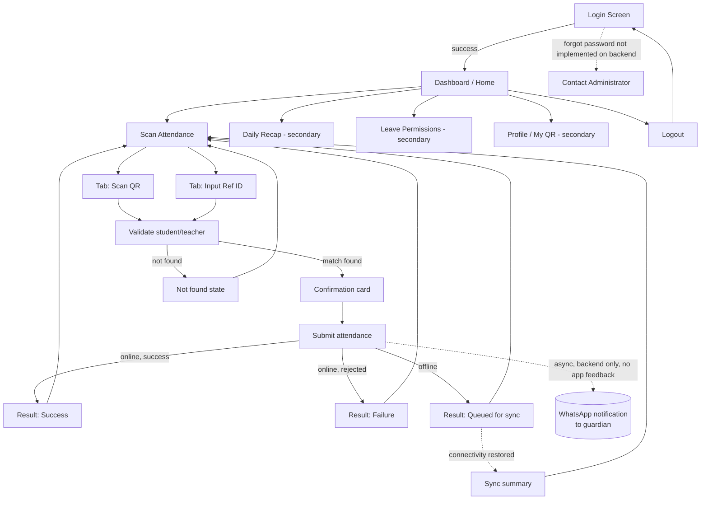
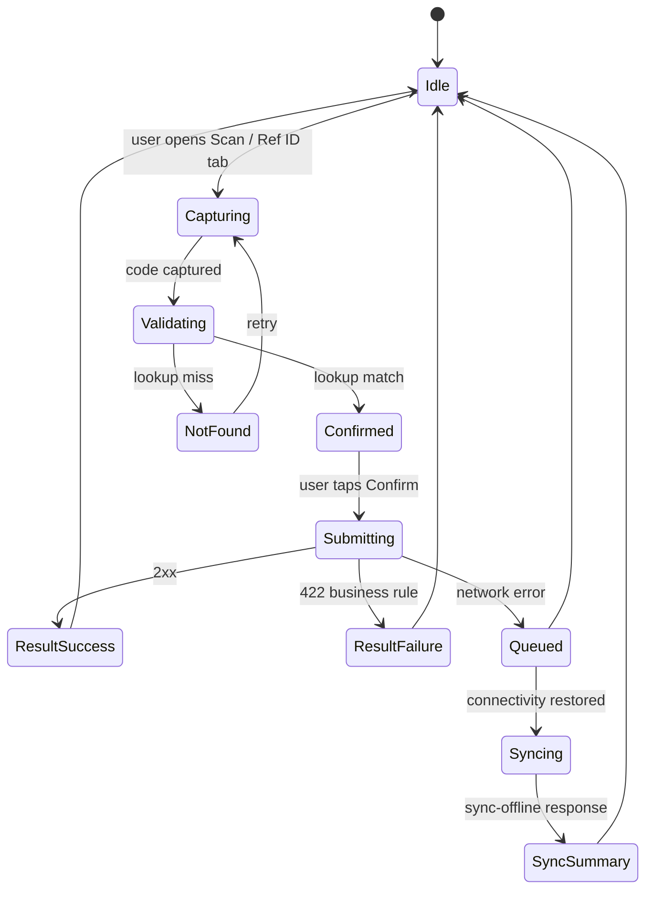

# 08 — UI/UX Flow (Flutter Mobile App)

Companion to [07-FEATURE-LIST.md](07-FEATURE-LIST.md). This document describes navigation, screen states, and the attendance flow in detail. A visual mockup (phone-frame wireframes + interactive flow diagram) was published separately for design review — see the note at the end of this document.

## 1. Overall navigation map



## 2. The priority attendance flow, step by step

```mermaid
flowchart LR
    A[Login] --> B[Dashboard]
    B --> C{Capture method}
    C -->|Camera| D[Scan QR]
    C -->|Reader/manual| E[Input Ref ID]
    D --> F[POST /scan/lookup]
    E --> F
    F -->|found| G[Confirm card:\nname, NIS/NIP, class]
    F -->|not found| H[Not-found state] --> C
    G --> I[POST /scan\nmasuk or pulang]
    I -->|2xx| J[Result: Success]
    I -->|422 business rule| K[Result: Failure\nexact backend message]
    I -->|network error| L[Queue locally]
    L --> M[POST /scan/sync-offline\nwhen online]
    J --> N[(async)\nWhatsApp event fired]
    J --> C
    K --> C
```

**Key UX decision embedded above**: a failed lookup (`F`→`H`) never reaches Submit. A failed *submission* (`K`) is still shown as a distinct, actionable message — the operator needs to read it (e.g. "already checked in"), not just get bounced back silently.

## 3. Screen-by-screen detail

### 3.1 Login

```
┌─────────────────────────┐
│      [School Logo]      │
│                          │
│   Email                 │
│   [_____________________]│
│   Password               │
│   [_____________________]│
│                          │
│   [ ] Remember me        │
│                          │
│   [    LOG IN    ]       │
│                          │
│   Butuh bantuan? Hubungi │
│   administrator sekolah  │
│   (no working "forgot    │
│    password" link — see  │
│    02-MOBILE-REQUIREMENTS│
│    §5)                   │
└─────────────────────────┘
```
States: idle → submitting (spinner in button, fields disabled) → error (inline red text under the relevant field, or a banner for 401/403 whole-form errors) → success (navigate away, no visible transition needed on this screen).

### 3.2 Dashboard

```
┌─────────────────────────┐
│ Hi, {full_name}     [≡] │
│ {role label}             │
│                          │
│ ┌──────────┐┌──────────┐│
│ │ Hadir     ││ Terlambat││
│ │   142      ││    5     ││
│ └──────────┘└──────────┘│
│                          │
│ ┌──────────────────────┐│
│ │  📷 SCAN ATTENDANCE   ││  ← primary CTA, largest element on screen
│ └──────────────────────┘│
│                          │
│ Izin menunggu persetujuan: 3 >   (secondary, role-gated)
│ Rekap hari ini            >      (secondary)
└─────────────────────────┘
```
States: loading (skeleton cards), loaded, empty (zero-state copy instead of "0" tiles if genuinely no data), stale/offline (small banner: "showing cached data").

### 3.3 Scan screen — tabs for QR vs Ref ID

```
┌─────────────────────────┐
│  ← Scan Attendance       │
│  [ Scan QR ] [ Ref ID ]  │  ← segmented tab control
│ ┌──────────────────────┐│
│ │                      ││
│ │   (live camera view) ││
│ │    ┌──────────┐      ││
│ │    │  guide   │      ││
│ │    │  frame   │      ││
│ │    └──────────┘      ││
│ │                      ││
│ └──────────────────────┘│
│        [🔦 Flash]        │
│                          │
│  Pending sync: 2  [sync] │  ← only visible when offline queue > 0
└─────────────────────────┘
```
Ref ID tab replaces the camera view with a single large text field (autofocus, numeric/alphanumeric keyboard) and a "Submit" button — sized generously since it also serves as the target for an RFID reader's keystroke output.

States: scanning (idle, waiting for a decode), decoded→validating (brief overlay spinner), holiday pre-warning banner (from bootstrap data, dismissible, non-blocking).

### 3.4 Validating / Confirmation card

```
┌─────────────────────────┐
│                          │
│   Memvalidasi kode...    │   ← brief, ~1s
│        (spinner)         │
│                          │
└─────────────────────────┘
```
On match:
```
┌─────────────────────────┐
│  ✅ Siswa ditemukan       │
│                          │
│   Budi Santoso           │
│   NIS: 2024001           │
│   Kelas: 7A              │
│                          │
│  ( ) Masuk   ( ) Pulang  │  ← explicit toggle if the "infer from time" decision (see 02-MOBILE-REQUIREMENTS §6) is resolved against auto-inference
│                          │
│  [     KONFIRMASI     ]  │
│  [       Batal         ] │
└─────────────────────────┘
```
On no match:
```
┌─────────────────────────┐
│  ❌ Kode tidak ditemukan  │
│                          │
│  [   Scan Ulang   ]      │
│  [  Input Manual   ]     │
└─────────────────────────┘
```

### 3.5 Result — Success

```
┌─────────────────────────┐
│                          │
│         ✅               │
│    Absen Masuk Berhasil  │
│                          │
│    Budi Santoso          │
│    07:12 · Tepat waktu   │
│                          │
│  (if late instead:)      │
│    07:42 · Terlambat 12 menit │
│                          │
│  [    SCAN BERIKUTNYA   ]│
└─────────────────────────┘
```
Auto-dismiss after ~3s **or** manual tap — configurable, but must never block the operator from re-scanning immediately if they choose to tap through. No claim of "orang tua telah diberitahu" (parent notified) appears here — see F9's acceptance criteria; if any WhatsApp-related copy is shown at all, it must be phrased as "notifikasi akan dikirim jika diaktifkan," not a confirmed-delivered statement.

### 3.6 Result — Failure

```
┌─────────────────────────┐
│                          │
│         ⚠️                │
│  Siswa sudah melakukan   │
│  absen masuk pada 07:05  │  ← exact backend message, not paraphrased
│                          │
│  [        OK           ] │
└─────────────────────────┘
```
Requires an explicit tap to dismiss (unlike success, which may auto-dismiss) — the operator must consciously acknowledge a failure so it isn't missed in a fast scanning rhythm.

### 3.7 Result — Queued (offline)

```
┌─────────────────────────┐
│         🕒                │
│   Disimpan, akan         │
│   disinkronkan otomatis  │
│                          │
│   Budi Santoso · Masuk   │
│   Menunggu koneksi...    │
│                          │
│  [    SCAN BERIKUTNYA   ]│
└─────────────────────────┘
```

### 3.8 Sync summary (after connectivity returns)

```
┌─────────────────────────┐
│  Sinkronisasi Selesai     │
│                          │
│  ✅ 5 berhasil            │
│  ⚠️ 1 gagal:              │
│    • Ani W. — sudah absen│
│      masuk sebelumnya    │
│                          │
│  [   Coba Lagi (1)   ]   │
│  [       Tutup        ]  │
└─────────────────────────┘
```

## 4. State machine summary (Scan flow)



## 5. Visual mockup for design review

A rendered visual mockup (phone-frame wireframes for every screen above, plus an interactive version of the flow diagram) has been published as a separate artifact for design review, since static markdown/ASCII is a poor substitute for actually seeing the screens. Ask for the link if it wasn't shared alongside this document, or regenerate it from this spec — the wireframe content above is the source of truth it was built from.

No Flutter/Dart implementation code has been written at this stage, per scope — this document and its companion mockup are design artifacts only.
